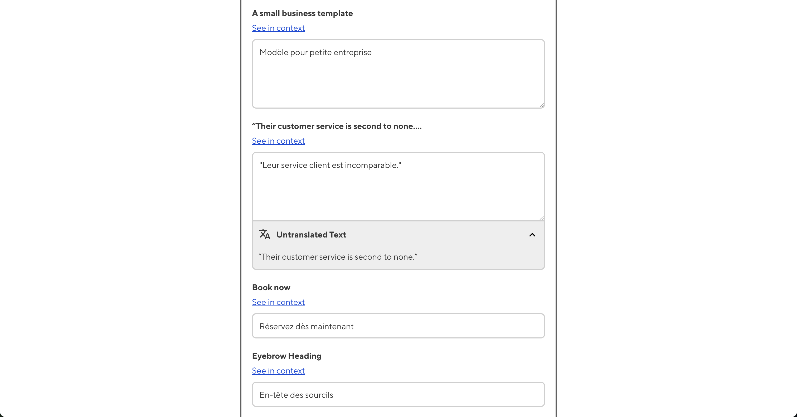

# Rosey CloudCannon Connector

See more detailed documentation [here](https://rad-turnip.cloudvent.net/).

The Rosey CloudCannon Connector provides a way to enter and edit translations used by [Rosey](https://rosey.app/) inside of CloudCannon's CMS. It then turns these translations into the JSON files that Rosey uses in tandem with your site's tagged HTML to generate a multilingual site. 

Translations are displayed to editors in a form-like interface, with links to each original phrase in context on it's untranslated page. An optional [Smartling](https://www.smartling.com/) integration is provided for automatic [AI-powered machine translations](https://www.smartling.com/software/smartling-translate/), which editors can then QA and edit as needed.

## How it works

1. A developer tags HTML elements on your site for translation using `data-rosey` tags.

2. Rosey scans your built static site for `data-rosey` tags and generates a JSON file named `base.json`, containing information about your all of your tagged content.

3. The Rosey CloudCannon Connector generates YAML files which are displayed to editors in the CMS. Editors fill in translations.

4. These YAML files are turned into the `locales/*.json` files which Rosey needs to generate the multilingual site.

3. Rosey ingests the `locales/*.json` files, which contain each original phrase paired with a user entered translation. Using this data, and your tagged HTML, Rosey generates a complete multilingual site.

All of this file generation happens in your site's postbuild - meaning it happens automatically each build.

## Is this workflow right for you?

Depending on your usecase this workflow could be unnecessary, and you would be better suited to simply dividing your different language content into separate directories and maintaining each separately. Read [this blog post](https://cloudcannon.com/blog/managing-multilingual-content-in-cloudcannon/) before getting starting with the RCC. 
